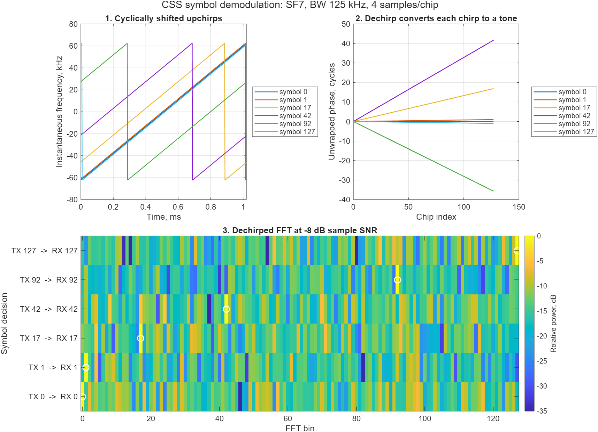
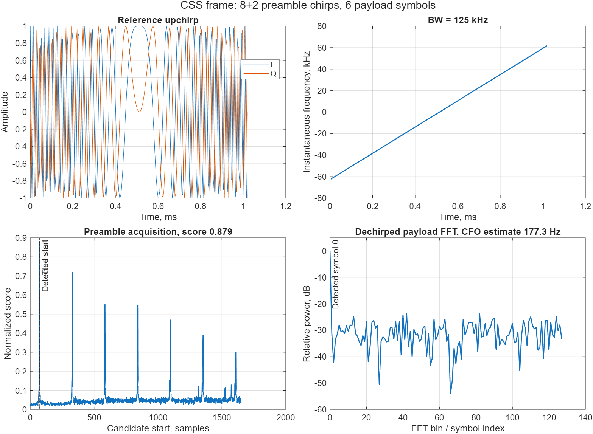

# Zynq LoRa PHY and Positioning

[Русская версия документации](README.ru.md)

FPGA/SDR implementation of LoRa communication, precise time-of-arrival (ToA)
estimation, and time-difference-of-arrival (TDoA) positioning.

The project is an engineering and research platform, not a replacement for a
low-power commercial LoRa transceiver. Its purpose is to expose the complete
PHY processing chain, make internal measurements observable, and provide a
repeatable path from a MATLAB floating-point reference model through Simulink
and generated Verilog to a ZynqSDR implementation.

> Status: executable MATLAB floating-point CSS model with hard- and
> soft-decision LoRa packet decoding, validated against recorded on-air SX1262
> transmissions. The Simulink architecture, generated Verilog, and board support
> are planned; the repository does not yet contain a hardware LoRa receiver.

## Project goals

- Receive and transmit LoRa-compatible packets with a ZynqSDR platform.
- Build a traceable implementation path: MATLAB float → Simulink → generated
  Verilog → ZynqSDR.
- Estimate timing, CFO, SFO, RSSI, and SNR in addition to decoded payloads.
- Timestamp packet arrivals in programmable logic on multiple synchronized
  receivers.
- Measure and calibrate systematic channel delays before solving 2D TDoA.
- Keep experiments reproducible through versioned configurations, captures,
  metrics, and reports.

The first hardware milestone is deliberately narrow:

> Complete and validate the MATLAB floating-point PHY and ToA/TDoA algorithms,
> beginning with the receiver at BW 125 kHz and SF7. Then reproduce HDL-bound
> blocks as a streaming Simulink model and generate dechirp, FFT, peak-detector,
> and timing Verilog from that model using the same test vectors.

## Current contents

- `model/matlab/` — authoritative floating-point CSS/LoRa model and MATLAB unit
  tests.
- `model/simulink/` — planned streaming and fixed-point implementation used as
  the HDL Coder source.
- `src/zynq_lora_phy/` — auxiliary independent NumPy checks for CSS, ToA, and
  TDoA; not the golden implementation.
- `tests/` — deterministic unit tests for symbol recovery, impairments, ToA,
  and multilateration.
- `docs/` — architecture, development roadmap, and test-bench requirements.
- `experiments/templates/` — versioned metadata templates for ToA and TDoA
  measurements.
- `fpga/`, `firmware/`, and `hardware/` — integration boundaries for later
  PL, PS, and board-specific work.

## MATLAB quick start

MATLAB R2025a is currently used for local validation. From the repository root:

```matlab
cd model/matlab
results = run_tests;
assertSuccess(results);
```

Generate the acquisition, uncoded CSS, and coded packet BER/PER figures:

```matlab
outputs = run_visualizations;
```

Inspect an RTL-SDR CU8 or Pluto/GNU Radio CF32 recording visually and estimate
its strongest packet's BW, SF, carrier offset, symbol duration, SNR, and
dechirped FFT bins:

```matlab
addpath apps
app = lora_phy_inspector;
```


See the **[LoRa PHY Inspector guide](docs/lora-phy-inspector.md)** for input
formats, interpretation, methodology, and current limits.

With a serial-controlled transmitter and PlutoSDR or RTL-SDR connected to the
same computer, the complete transmit → record → analyze sequence can be run by
[`tools/run_phy_experiment.py`](tools/run_phy_experiment.py). Start with a
hardware-free `--dry-run`; the full workflow is documented in
[One-machine transmit, capture, and analysis](docs/automated-phy-experiment.md).

The symbol-demodulation view shows how different cyclic shifts become distinct
dechirped tones and FFT peaks:



The acquisition receiver detects a research `8 upchirp + 2 downchirp`
preamble, estimates CFO, and recovers aligned payload symbols. It is an
algorithm-development frame. Separately, `encode_packet` and `decode_packet`
implement explicit header, payload CRC, whitening, Hamming FEC, diagonal
interleaving, and Gray/CSS mapping with all intermediate values exposed.




## What the BER figure means

The uncoded curves are a **demodulator baseline**, not coded LoRa packet BER.
They compare the legacy single-phase and polyphase receivers, the HDL-oriented
FFT correlator, and an independent exact matched filter for 1, 2, 4, and 8
samples/chip. The FFT correlator closes the former 5–6 dB `L=8` AWGN gap.
Preamble failures, whitening, FEC, interleaving, CRC, and rejected packets are
excluded from these uncoded curves.

The coded campaign compares hard and soft decoding for SF5, SF6, and SF7 at
CR 4/5, 8 samples/chip, and a 16-byte payload. It reports pre-FEC BER, hard and
soft payload BER/PER, soft recoveries, raw counts, and 95% Wilson intervals.
Known packet timing still excludes preamble-detection failures. Measurement
definitions, SNR convention, trial counts, zero-error marker rule, and data are in the
**[BER/SER methodology](docs/ber-methodology.md)**. The implemented coding chain is
described in **[LoRa PHY coding stages](docs/lora-phy-coding.md)**.

## Auxiliary Python checks

Python 3.10 or newer is recommended.

```bash
python -m venv .venv
python -m pip install -e ".[dev]"
pytest
python examples/css_roundtrip.py
```

The example generates deterministic CSS symbols, applies AWGN and carrier
frequency offset, compensates the known offset, and demodulates the symbols.

## Repository layout

```text
.
├── docs/                   Architecture, roadmap, and bench requirements
├── model/
│   ├── matlab/             Authoritative floating-point model and tests
│   └── simulink/           HDL-oriented executable architecture
├── examples/               Auxiliary Python examples
├── experiments/
│   └── templates/          PHY capture and ToA/TDoA metadata
├── captures/               Local captures plus curated Git LFS references
├── tools/                  Hardware capture helpers
├── fpga/                   PL/RTL sources, constraints, and verification
├── firmware/               Zynq PS software and host control
├── hardware/               Board notes, clocking, and calibration data
├── src/zynq_lora_phy/      Auxiliary Python reference package
└── tests/                  Auxiliary Python tests
```

## Architecture and plan

- [System architecture](docs/architecture.md)
- [Roadmap and acceptance criteria](docs/roadmap.md)
- [Hardware test bench](docs/test-bench.md)
- [RTL-SDR and PlutoSDR packet-capture guide](docs/iq-capture-guide.md)
- [Experiment workflow](experiments/README.md)
- [Heltec V4.3/SX1262 to ZynqSDR hardware sweep](docs/hardware-sweep-2026-08-03-heltec-v43.md)
- **[BER/SER methodology](docs/ber-methodology.md)**
- **[Whitening, FEC, interleaving, and CRC](docs/lora-phy-coding.md)**
- [Documentation index](docs/README.md)

## Measurement principles

1. Define and validate algorithms in the MATLAB float model.
2. Compare MATLAB, Simulink, generated Verilog, and hardware with identical test
   vectors.
3. Generate precise timestamps in PL, never from Linux or network arrival time.
4. Treat cable, splitter, RF, ADC, and DSP delays as calibrated quantities.
5. Record configuration and provenance with every result.

## Contributing

Keep changes small and measurable. New DSP blocks should include a reference
model, deterministic tests, numerical tolerances, and a documented hardware
mapping. See [CONTRIBUTING.md](CONTRIBUTING.md).

## License

Licensed under the Apache License, Version 2.0. See [LICENSE](LICENSE).
Contributions are accepted under the same license.
