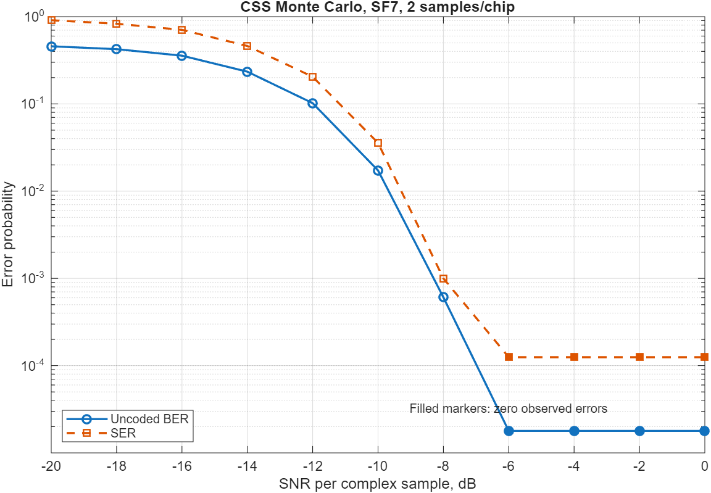
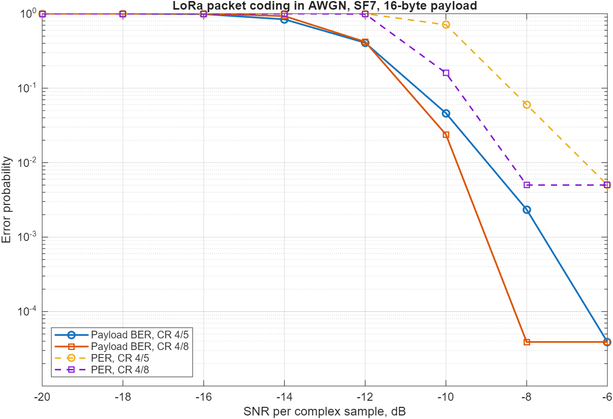

# Zynq LoRa PHY и позиционирование

[English version](README.md)

Проект реализации LoRa PHY, точного определения времени прихода сигнала (ToA)
и позиционирования по разности времён прихода (TDoA) на FPGA/SDR-платформе
ZynqSDR.

Это инженерная и исследовательская платформа, а не замена маломощному серийному
LoRa-трансиверу. Её задача — сделать наблюдаемой всю цепочку PHY и обеспечить
воспроизводимый переход от эталонной MATLAB-модели с плавающей точкой через
Simulink и автоматически сгенерированный Verilog к аппаратной реализации.

> Текущее состояние: работает MATLAB-модель CSS и жёсткого декодирования
> LoRa-пакета. Simulink-архитектура, Verilog и поддержка платы будут добавлены
> после проверки совместимости с реальными пакетами SX1262.

## Цели

- Приём и передача LoRa-совместимых пакетов на ZynqSDR.
- Прослеживаемый маршрут: MATLAB float → Simulink → Verilog → ZynqSDR.
- Оценка времени, CFO, SFO, RSSI и SNR вместе с декодированным payload.
- Формирование временных меток пакета в программируемой логике.
- Калибровка постоянных задержек трактов перед решением задачи 2D TDoA.
- Воспроизводимые эксперименты с версиями конфигураций, записей и результатов.

Первый аппаратный этап намеренно ограничен BW 125 кГц и SF7:

> Сначала полностью проверяем MATLAB-модель PHY и ToA/TDoA. Затем переносим
> HDL-ориентированные блоки в потоковую fixed-point модель Simulink и генерируем
> Verilog для dechirp, FFT, поиска пика и временной оценки.

## Что уже реализовано

- генерация upchirp/downchirp и CSS-модуляция;
- dechirp и FFT-демодуляция;
- AWGN, CFO, обнаружение исследовательской преамбулы;
- explicit header, payload CRC, whitening, FEC CR 4/5…4/8;
- диагональный interleaving и Gray/CSS mapping;
- полный бесшумный packet round-trip;
- uncoded BER/SER и coded payload BER/PER;
- детерминированные golden-векторы и MATLAB-тесты;
- вспомогательные Python-проверки CSS, ToA и TDoA.

## Быстрый запуск MATLAB

Используется MATLAB R2025a. Из корня репозитория:

```matlab
cd model/matlab
results = run_tests;
assertSuccess(results);
```

Построение всех графиков:

```matlab
outputs = run_visualizations;
```

Для визуального анализа записи RTL-SDR CU8 или Pluto/GNU Radio CF32 и оценки
BW, SF, смещения несущей, длительности символа, SNR и dechirp FFT запустите:

```matlab
addpath apps
app = lora_phy_inspector;
```


Форматы входа, методика и ограничения описаны в
**[руководстве по LoRa PHY Inspector](docs/ru/lora-phy-inspector.md)**.

Демодуляция нескольких CSS-символов:


График показывает циклически сдвинутые chirp, преобразование в тон после
dechirp и выбор соответствующего FFT-bin.






## Быстрый запуск Python-проверок

```bash
python -m venv .venv
python -m pip install -e ".[dev]"
pytest
python examples/css_roundtrip.py
```

Python-модель является вспомогательной независимой проверкой. Авторитетной
алгоритмической моделью остаётся MATLAB.

## Структура репозитория

```text
docs/                   архитектура, методики и требования к стенду
model/matlab/           авторитетная MATLAB float-модель и тесты
model/simulink/         будущая потоковая fixed-point модель
src/zynq_lora_phy/      вспомогательная Python-модель
experiments/templates/  шаблоны PHY capture, ToA и TDoA
captures/               локальные IQ-записи, не добавляемые в Git
tools/                  утилиты записи с оборудования
fpga/                   интеграция PL/RTL и ограничения
firmware/               программное обеспечение Zynq PS
hardware/               сведения о платах, тактировании и калибровке
```

## Русская документация

- [Оглавление](docs/ru/README.md)
- [Архитектура](docs/ru/architecture.md)
- [Дорожная карта](docs/ru/roadmap.md)
- [LoRa PHY: whitening, FEC, interleaving и CRC](docs/ru/lora-phy-coding.md)
- [Методика BER/SER/PER](docs/ru/ber-methodology.md)
- [Запись SX1262 с RTL-SDR и PlutoSDR](docs/ru/iq-capture-guide.md)
- [Требования к стенду](docs/ru/test-bench.md)
- [MATLAB-модель](docs/ru/matlab-model.md)
- [Проведение экспериментов](docs/ru/experiments.md)
- [Simulink и путь к Verilog](docs/ru/simulink.md)

## Принципы измерений

1. Сначала определить и проверить алгоритм в MATLAB float.
2. Сравнивать MATLAB, Simulink, Verilog и аппаратуру одними golden-векторами.
3. Формировать точные временные метки в PL, а не по времени Linux/Ethernet.
4. Считать задержки кабелей, RF, ADC и DSP калибруемыми величинами.
5. Сохранять конфигурацию и происхождение каждого результата.

## Лицензия и вклад

Новые DSP-блоки должны иметь эталонную модель, детерминированные тесты,
численные допуски и описание аппаратного отображения. Подробности приведены в
[CONTRIBUTING.ru.md](CONTRIBUTING.ru.md).
