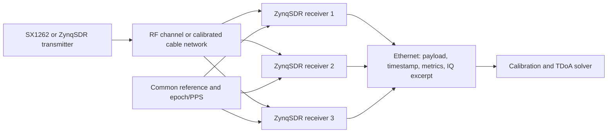
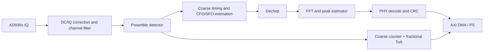

# System architecture

## End-to-end view



Ethernet transports results but is not a timing reference. Fine arrival time is
measured against a counter in programmable logic. A common reference stabilizes
sample clocks; a common epoch signal aligns the counters.

## Receiver partition



### Programmable logic (PL)

- deterministic sample-rate processing;
- channel selection and decimation;
- preamble correlation and dechirp/FFT detection;
- coarse 64-bit sample counter and fractional ToA;
- capture trigger and bounded IQ snapshot;
- AXI-Stream metadata framing.

### Processing system (PS)

- AD936x and clock-tree configuration;
- run control and health monitoring;
- packet assembly and non-real-time decode stages during early development;
- calibration table management;
- Ethernet transport and capture storage.

### Host

- golden-model regression;
- experiment orchestration;
- cross-receiver event association;
- delay correction and TDoA multilateration;
- plots, reports, and dataset provenance.

## Timing model

For receiver `i`, the reported timestamp is modeled as

```text
t_i = t_tx + range_i / c + d_i + noise_i
```

where `d_i` includes clock epoch offset, cable delay, RF/ADC group delay, and
DSP latency. TDoA eliminates the unknown transmit time, but not unequal `d_i`.
The calibrated observation relative to receiver 0 is

```text
Δt_i0 = (t_i - d_i) - (t_0 - d_0).
```

The system therefore separates:

- a coarse PL counter for unambiguous event time;
- a fractional estimator derived from correlation or FFT phase;
- a versioned per-channel calibration correction;
- an uncertainty estimate carried into the position solution.

## MATLAB-to-hardware traceability

The implementation flow is intentionally unidirectional:

```text
MATLAB floating point
        ↓ verified test vectors and numerical requirements
Simulink streaming architecture
        ↓ fixed-point types, rates, latency, and HDL-compatible controls
HDL Coder generated Verilog
        ↓ Vivado integration, constraints, and AXI wrappers
ZynqSDR hardware
```

Each hardware DSP block has four representations when applicable:

| Layer | Purpose | Required evidence |
|---|---|---|
| MATLAB float | Authoritative algorithm | `matlab.unittest`, plots, golden vectors |
| Simulink | Streaming architecture and fixed point | Error bounds vs MATLAB float |
| Generated Verilog | Cycle-accurate implementation | HDL cosimulation and golden-vector regression |
| Hardware | Real RF behavior | Versioned configuration and measurements |

The Simulink DUT boundary will initially contain the coherent FFT correlator:
an `N·L` FFT, reference-spectrum multiply, `L`-partition accumulation, `N` FFT,
and peak detection. Adaptive reference estimation, the polyphase fallback,
channel filtering, preamble detection, timestamping, fractional ToA, and
AXI-Stream control will be added after the symbol detector is verified. TDoA
event association, calibration, and multilateration remain software algorithms
validated in MATLAB; they are not initial HDL Coder targets. Generated Verilog
is treated as a build artifact of the reviewed model and generation scripts,
not as a second hand-maintained implementation.

## Metadata contract

Every received event should eventually expose at least:

```text
station_id, sequence_id, center_frequency_hz, bandwidth_hz, spreading_factor,
coarse_sample_count, fractional_toa_samples, cfo_hz, sfo_ppm, rssi_dbfs,
snr_db, crc_ok, payload, calibration_id, software_revision
```

Field names include units so that experiments can be compared without hidden
conventions.
