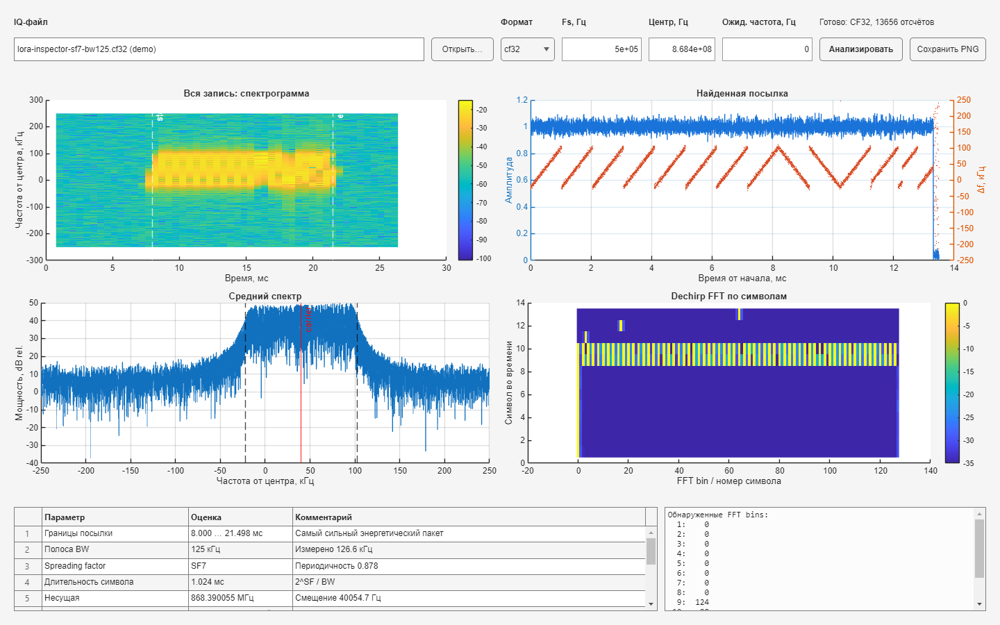

# LoRa PHY Inspector

LoRa PHY Inspector is the project-native MATLAB tool for looking inside an IQ
recording before attempting packet decoding. It loads a headerless recording,
finds the strongest CSS burst, estimates its main parameters, identifies the
corresponding LoRa PHY/radio profile, and shows the same intermediate
representations that later become Simulink and RTL receiver blocks.



## Start the application

From the repository root:

```matlab
cd model/matlab
addpath apps
app = lora_phy_inspector;
```

To try it without radio hardware, generate the deterministic example first:

```matlab
addpath examples
file = generate_inspector_demo_capture;
app = lora_phy_inspector;
app.FileField.Value = file;
app.SampleRateField.Value = 500e3;
```

Then press **Analyze**. The example contains an SF7, BW 125 kHz research frame
at a +40 kHz offset from the capture center.

## Input fields

All Inspector UI labels are intentionally English so screenshots and reports
can be reused in the repository and external engineering documentation.

- **IQ recording** — a headerless interleaved complex recording.
- **Format** — `auto`, `cu8`, `cf32`, or `ci16`. Automatic selection uses the
  filename extension; `.pcm`, `.ci16`, and `.sc16` are treated as signed
  complex int16.
- **Sample rate** — actual IQ sample rate in samples per second.
- **Center frequency** — SDR tuning frequency in hertz. Use `0` for a pure
  baseband simulation with no RF center frequency.
- **Expected carrier** — nominal transmitter frequency. Set it to zero when it
  is unknown; otherwise the application reports CFO relative to it.

Supported file layouts are:

| Format | Extensions | Component order | Scaling |
|---|---|---|---|
| RTL-SDR CU8 | `.cu8`, `.uc8` | unsigned 8-bit `I,Q,I,Q,...` | mapped approximately to `[-1,1]` |
| Pluto/GNU Radio CF32 | `.cf32`, `.fc32`, `.cfile` | little-endian float32 `I,Q,I,Q,...` | preserved as stored |
| CI16/SC16 | `.pcm`, `.ci16`, `.sc16` | little-endian signed int16 `I,Q,I,Q,...` | divided by 32768 |

## HDL CI16 recording

The HDL testbench writes a conventional CI16 stream:

```text
I0, Q0, I1, Q1, ...
```

Each component is signed little-endian `int16`. Inside the HDL,
`data_out[31:16]` is `I` and `data_out[15:0]` is `Q`; the testbench explicitly
emits bytes as `I_lo,I_hi,Q_lo,Q_hi`. A standard complex-int16 reader therefore
sees the correct I/Q order directly.

`phase_to_sample` currently produces roughly Q14 amplitude (`±16384`). This is
a numerical property of the HDL signal, not a separate file format. Inspector
normalizes CI16 by the full signed-int16 range, 32768, so a nominal HDL chirp
appears with magnitude around `0.5`.

HDL recording names must encode the key parameters:

```text
hdl_sf<SF>_bw<BW_KHZ>k_fs<FS_KHZ>k_<TAG>.pcm
```

Examples:

```text
hdl_sf7_bw125k_fs2000k_package.pcm
hdl_sf7_bw125k_fs2000k_chirp-h17-up.pcm
hdl_sf7_bw125k_fs2000k_chirp-h64-down.pcm
```

Use the helper beside the recordings:

```matlab
cd hdl/signal
open_in_inspector("hdl_sf7_bw125k_fs2000k_package.pcm")
```

It parses SF/BW/Fs from the filename, selects `ci16`, fills in the sample rate,
and enables the automatic MATLAB golden comparison.

## MATLAB golden verification

For a correctly named HDL CI16 file, Inspector does more than estimate the
signal parameters. It also compares one complete CSS symbol against the
authoritative MATLAB reference generated by `reference_chirp` / `modulate_symbol`.

For a `package` capture the reference is the first preamble `h=0` upchirp. A
single-chirp filename such as `chirp-h17-up` or `chirp-h64-down` selects that
symbol and direction explicitly.

The comparison searches a small sample-alignment window around the detected
symbol boundary and removes only one constant complex gain/phase coefficient.
It then reports:

- **Golden EVM** — RMS complex error relative to the fitted reference;
- **Golden correlation** — normalized complex correlation magnitude;
- **RMS phase error** and maximum phase error;
- **Peak sample error** after gain/phase normalization;
- sample-boundary adjustment selected by the golden search;
- a simple **PASS/WARN** verdict.

The current diagnostic PASS thresholds are intentionally strict for a digital
HDL simulation: EVM `<= 1 %`, correlation `>= 0.999`, and RMS phase error
`<= 1 degree`. These are regression thresholds, not RF compliance limits.

The same core function can be called without the GUI:

```matlab
metrics = lora_phy.compare_iq_to_golden( ...
    iq, 2e6, 7, 125e3, StartIndex=startIndex, Symbol=0, Direction="up");
```

## LoRa PHY and radio identification

After estimating SF and BW, Inspector reports a PHY profile such as:

```text
LoRa / SF7 / BW 125 kHz
PACKET_TYPE_LORA
```

It then matches the profile against a small built-in Semtech capability table.
When an RF center frequency is known, frequency range is included in the
filter. The current table covers the project-relevant SX126x/SX127x family,
LLCC68, and SX1280/SX1281.

For the project's current SF7/BW125 reference profile, **SX1262** is shown as
the project reference radio because the Heltec V4.3 test nodes use SX1262.
Other compatible radios can also be listed; this is a PHY/radio capability
match, not proof of a specific transmitter identity.

LoRaWAN data-rate indices are deliberately not inferred because the DR mapping
is region-dependent.

## What the four plots mean

1. **Full recording: spectrogram** locates the strongest energetic burst and
   shows the selected start and end. It is the first check for clipping,
   aliases, interferers, and an incorrect center frequency.
2. **Detected CSS/LoRa burst** overlays magnitude and phase-difference
   instantaneous frequency. A LoRa upchirp appears as a rising ramp with a
   periodic wrap; a downchirp slopes down.
3. **Average spectrum** shows occupied bandwidth, estimated carrier, and the
   snapped LoRa bandwidth boundaries.
4. **Per-symbol dechirped FFT** has time-ordered symbols in rows and FFT bins in
   columns. Repeated preamble upchirps form repeated bright peaks. Downchirps do
   not collapse to one bin with an upchirp reference and therefore appear
   spread.

When the working signal is oversampled, each row combines FFT power from every
polyphase chip-rate view. No single decimation phase is treated as privileged.

The symbol list contains hard FFT-bin decisions. It is diagnostic output, not
proof that a standards-compliant packet was decoded.

## Estimates and method

The current estimator:

1. computes short-block energy and selects the strongest contiguous burst;
2. estimates occupied bandwidth and carrier from the instantaneous-frequency
   distribution, then snaps bandwidth to 125, 250, or 500 kHz;
3. compares normalized autocorrelation at candidate LoRa symbol periods to
   estimate SF5 through SF12;
4. refines the first upchirp boundary with dechirp and FFT concentration;
5. estimates residual frequency error from repeated preamble upchirps;
6. reports relative signal/noise power, SNR, DC offset, I/Q power imbalance,
   and integer-component clipping for CU8/CI16;
7. identifies a compatible LoRa radio profile;
8. for named HDL CI16 captures, runs the MATLAB golden comparison.

All DSP is implemented without Communications Toolbox or Signal Processing
Toolbox dependencies. The analyzer API can also be used without the UI:

```matlab
[iq, info] = lora_phy.load_iq_capture("capture.cf32", "auto");
result = lora_phy.inspect_iq_capture(iq, 1e6);
```

## Measurement limits

- Only the strongest burst is analyzed; multi-packet browsing is not yet
  implemented.
- The GUI remains an estimator/verification tool. For a known BW/SF profile,
  `receive_lora_packet` performs standard sync/header/payload decoding and CRC
  validation on real SX1262 recordings.
- Radio identification means capability compatibility only. It cannot identify
  the physical transmitter chip uniquely from the waveform.
- Golden PASS/WARN is a project regression criterion, not a LoRaWAN or radio
  certification result.
- Signal power is relative to the stored sample scale. It is not calibrated
  RSSI or received power in dBm.
- Bandwidth and SF estimation assume a LoRa-like CSS preamble and the standard
  candidate sets.
- The current project frame is `8 upchirps + 2 downchirps + uncoded symbols`.
  Standard LoRa sync-word/header waveform detection and SX1262 payload decoding
  remain a separate interoperability milestone.
- Live streaming from PlutoSDR and RTL-SDR is not yet part of the application;
  capture to a file first.

For independent visual checks, the same recordings can be opened in
[Inspectrum](https://github.com/miek/inspectrum). SDRangel can be used for live
radio inspection, and [gr-lora_sdr](https://github.com/tapparelj/gr-lora_sdr)
is a useful independent LoRa receiver reference. These tools complement rather
than replace the traceable MATLAB-to-Simulink implementation in this project.
