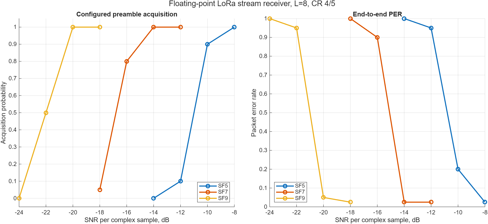
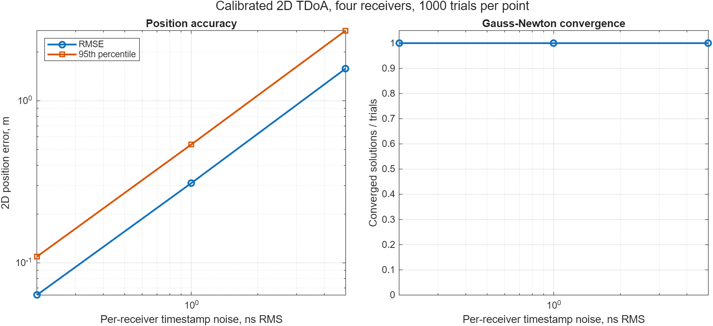

# MATLAB M1 floating-point acceptance

[Русская версия](ru/matlab-m1-acceptance.md)

M1 is complete at the floating-point algorithm boundary. The configured
receiver now accepts continuous complex IQ, finds complete LoRa packets,
resolves timing and carrier offset, decodes the header and payload, and reports
acquisition, pre-FEC, CRC, BER, and PER outcomes. The same MATLAB layer also
contains fractional ToA, calibrated TDoA observations, and a weighted 2D
multilateration solver. Simulink is deliberately not part of this acceptance.

## Receiver contract

```text
continuous configured IQ
  -> energy candidates + chirp-sequence candidates
  -> repeated-upchirp, sync-word, and downchirp validation
  -> joint timing/CFO estimate from upchirp and downchirp bins
  -> explicit or implicit header packet decode
  -> deinterleaving, FEC, dewhitening, CRC, payload
  -> detection, false-alarm, BER, and PER accounting
```

The chirp detector validates the configured sync transition and two SFD
downchirps. This lets it acquire signals below the per-sample energy floor
without accepting a repeated payload symbol as a preamble. Energy and chirp
candidates are both retained, including the mixed-amplitude case in which a
strong packet crosses the energy threshold and a weaker packet does not.

An upchirp alone cannot uniquely separate a whole-chip timing displacement
from CFO: both move its dechirped peak. For the downchirp the timing term
changes sign while the CFO term does not. The receiver therefore uses the
half-sum of the signed up/down bins for CFO and their half-difference for
timing. This correction is what made the coherent path deterministic on the
committed real-IQ set.

## Reproduce

MATLAB R2025a, from `model/matlab`:

```matlab
results = run_tests;
assertSuccess(results);

addpath examples
report = run_m1_acceptance;
```

`run_m1_acceptance` writes the raw tables and MAT report under `docs/data` and
the two acceptance figures under `docs/images`. The SNR in the stream campaign
is nominal active-packet power divided by complex noise-sample power. Silence
does not dilute the reference power.

## End-to-end packet evidence

The sensitivity sweep uses `L=Fs/BW=8`, CR 4/5, a 16-byte payload, and 20
packets per point. Every row had zero unmatched false-alarm candidates and zero
duplicate candidates.

| SF | SNR, dB | acquired / 20 | PER |
|---:|---:|---:|---:|
| 5 | -14 / -12 / -10 / -8 | 0 / 2 / 18 / 20 | 1 / 0.95 / 0.20 / 0 |
| 7 | -18 / -16 / -14 / -12 | 1 / 16 / 20 / 20 | 1 / 0.90 / 0 / 0 |
| 9 | -24 / -22 / -20 / -18 | 0 / 10 / 20 / 20 | 1 / 0.95 / 0.05 / 0 |



The mode matrix exercises all 32 `SF5...SF12 x CR 4/5...4/8`
combinations at `L=4`, two packets per combination: 64/64 packets were
acquired and decoded with PER zero. Four five-packet impairment cases also
gave 20/20 exact payloads: baseline; 1.5 kHz CFO plus 20 ppm SFO and 1.75
sample delay; fractional-delay multipath; and I/Q imbalance, DC offset, 12-bit
ADC quantization, and clipping control.

The committed SX1262 -> ZynqSDR targeted captures remain the independent real
regression. All 130/130 transmissions pass acquisition, header, CRC, and exact
payload comparison; pre-FEC BER is 2.227%. After joint timing/CFO correction,
all 130 select the FFT correlator and none require the retained polyphase guard
path. The older 118/130 nominal and 56/74 hybrid split was caused primarily by
synchronization ambiguity, not proven chirp-shape mismatch.

Raw evidence:

- [`lora-end-to-end-sensitivity.csv`](data/lora-end-to-end-sensitivity.csv)
- [`lora-end-to-end-mode-coverage.csv`](data/lora-end-to-end-mode-coverage.csv)
- [`lora-end-to-end-impairments.csv`](data/lora-end-to-end-impairments.csv)
- [targeted hardware `performance-summary.json`](../captures/reference/2026-08-07-heltec-v43-zynqsdr-targeted/performance-summary.json)

## ToA and TDoA evidence

The existing fractional-ToA AWGN campaign contains 500 deterministic trials.
The calibrated 2D TDoA campaign uses four receivers around a 100 m by 80 m
area, uniformly distributed sources inside the array, known fixed receiver
delays, and 1,000 trials per timestamp-noise point.

| Timestamp noise per receiver | converged | position RMSE | 95th percentile |
|---:|---:|---:|---:|
| 0.2 ns RMS | 1000/1000 | 0.063 m | 0.109 m |
| 1 ns RMS | 1000/1000 | 0.310 m | 0.537 m |
| 5 ns RMS | 1000/1000 | 1.582 m | 2.713 m |



These are synthetic geometry results, not a claim about the present hardware
bench. Hardware ToA/TDoA still requires common clocks and epochs, PL sample
counters, cable/RF/ADC/DSP delay calibration, and measured uncertainty.

## Boundary of M1

The accepted receiver is configuration-aided: SF, BW, sync word, IQ polarity,
and implicit-header parameters are supplied for each pass. Blind multi-mode
classification, overlapping LoRa collisions, interference cancellation, and a
real-time streaming implementation are outside M1. The detector is an offline
floating-point reference and is intentionally compute-heavy. Those limits are
inputs to Simulink architecture work, not hidden claims of completion.
