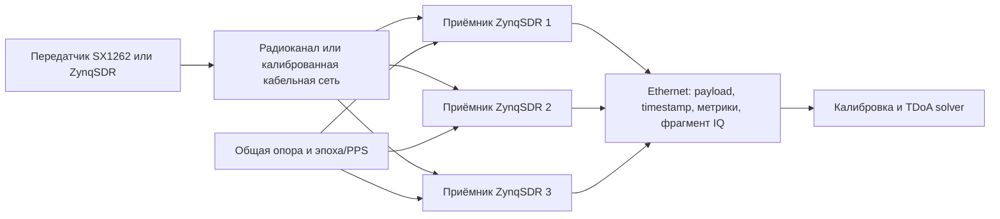
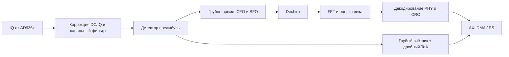

# Архитектура системы

[English version](../architecture.md)

## Сквозная схема



Ethernet передаёт результаты, но не является источником времени. Точное время
прихода измеряется счётчиком в программируемой логике. Общая частотная опора
стабилизирует sample clock, а общий сигнал эпохи выравнивает счётчики.

## Разделение функций приёмника



### Программируемая логика (PL)

- детерминированная обработка с частотой дискретизации;
- выбор канала и децимация;
- корреляция преамбулы, dechirp, FFT и обнаружение;
- 64-битный счётчик отсчётов и дробный ToA;
- триггер записи и ограниченный фрагмент IQ;
- формирование метаданных AXI-Stream.

### Процессорная система (PS)

- настройка AD936x и дерева тактирования;
- управление экспериментом и контроль состояния;
- сборка пакетов и нерегулярные этапы декодирования на ранней стадии;
- таблицы калибровки;
- Ethernet и хранение записей.

### Хост

- регрессия по golden-модели;
- управление экспериментами;
- сопоставление одного события между приёмниками;
- коррекция задержек и TDoA-мультилатерация;
- графики, отчёты и происхождение данных.

## Временная модель

Для приёмника `i` временная метка описывается как

```text
t_i = t_tx + range_i / c + d_i + noise_i,
```

где `d_i` включает сдвиг эпохи, задержку кабеля, групповую задержку RF/ADC и
латентность DSP. TDoA устраняет неизвестное время передачи, но не разность
`d_i`. Откалиброванное наблюдение относительно приёмника 0:

```text
Δt_i0 = (t_i - d_i) - (t_0 - d_0).
```

Поэтому система отдельно хранит грубый PL-счётчик, дробную оценку, версионную
поправку канала и неопределённость для решения координат.

## Прослеживаемость MATLAB → аппаратура

```text
MATLAB floating point
        ↓ проверенные векторы и численные требования
Simulink streaming/fixed point
        ↓ типы, частоты, задержки и HDL-совместимое управление
HDL Coder / Verilog
        ↓ Vivado, ограничения и AXI-обвязка
ZynqSDR
```

| Уровень | Назначение | Обязательное подтверждение |
|---|---|---|
| MATLAB float | Авторитетный алгоритм | тесты, графики, golden-векторы |
| Simulink | Потоковая архитектура и fixed point | границы ошибки относительно MATLAB |
| Verilog | Тактовая реализация | HDL cosimulation и golden-векторы |
| Аппаратура | Реальный RF-тракт | версионные настройки и измерения |

Первый DUT в Simulink содержит dechirp, FFT и поиск пика. Фильтрация, детектор
преамбулы, timestamp и дробный ToA добавляются после проверки символов. Связь
событий между станциями, калибровка и мультилатерация остаются в MATLAB/ПО, а не
в первом HDL DUT. Сгенерированный Verilog не редактируется вручную.

## Контракт метаданных

Каждое принятое событие должно в итоге содержать как минимум:

```text
station_id, sequence_id, center_frequency_hz, bandwidth_hz, spreading_factor,
coarse_sample_count, fractional_toa_samples, cfo_hz, sfo_ppm, rssi_dbfs,
snr_db, crc_ok, payload, calibration_id, software_revision
```

Единицы входят в имена полей, чтобы сравнение экспериментов не зависело от
скрытых соглашений.
