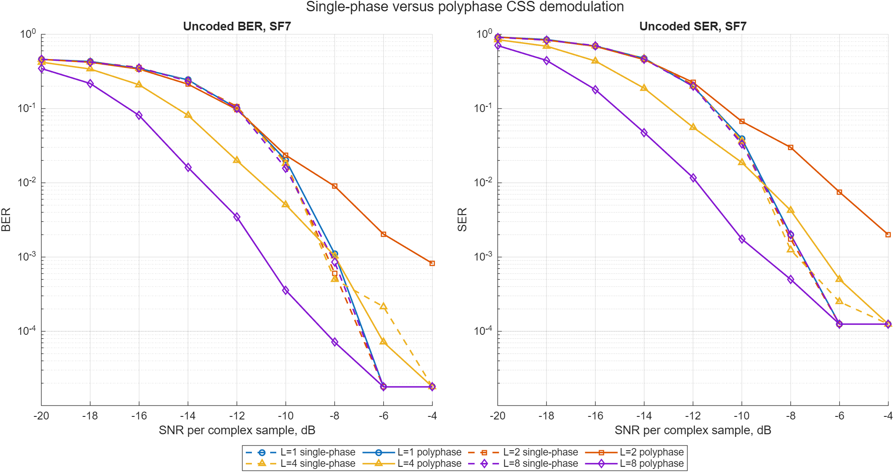
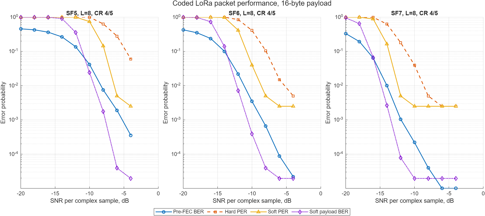

# Методика BER/SER/PER

[English version](../ber-methodology.md)

В репозитории отдельно измеряются ошибки демодулятора и ошибки пакетного
декодера. Оба AWGN-эксперимента используют фиксированные seed, исходные
счётчики ошибок, явные знаменатели и двусторонние 95%-интервалы Wilson.

## Сравнение single-phase и polyphase без FEC

`simulate_uncoded_ber` передаёт независимые равномерные CSS symbol indices при
известном времени символа. После добавления комплексного AWGN выполняются
dechirp, `2^SF`-point FFT и сравнение принятого индекса и его естественной
двоичной метки с переданными значениями.

Legacy-детектор по первой фазе децимации и рабочий polyphase-комбайнер получают
одинаковые seeded waveform и noise:

| Параметр | Значение |
|---|---:|
| SF | 7 |
| Samples/chip, `L` | 1, 2, 4, 8 |
| Демодуляторы | single-phase, polyphase |
| Символов на SNR/mode | 4 000 |
| Label bits на SNR/mode | 28 000 |
| SNR sweep | −20:2:−4 dB |
| Seed | `70 + L` |



Исходные результаты: [`css-ber-polyphase-comparison.csv`](../data/css-ber-polyphase-comparison.csv).
При `L=8` и −10 dB наблюдаемый BER снижается с `1,57e−2` до `3,57e−4`, то
есть примерно в 44 раза. Для `L=4` выигрыш меньше. При `L=2` улучшение не
монотонно: текущая некогерентная сумма мощностей может объединять энергию
соседних bins около циклического переноса chirp и ухудшать часть waterfall.
Это ограничение нужно устранить или явно принять до фиксации Simulink-архитектуры.

В uncoded baseline не входят acquisition, whitening, interleaving, FEC,
header, CRC, packet rejection, CFO/SFO, multipath и clipping. Это характеристика
демодулятора, а не прикладная пакетная надёжность.

## Определение SNR и энергии

`SNR_dB` — отношение средней мощности complex signal sample к средней мощности
complex noise sample до dechirp. Для `L = samplesPerChip`:

```text
Fs = BW × L
Ns = 2^SF × L
Es/N0 [dB] = SNRsample [dB] + 10 log10(Ns)
Eb/N0 [dB] = SNRsample [dB] + 10 log10(Ns / SF)
```

Последняя формула относится к `SF` uncoded label bits. В uncoded CSV сохранены
обе пересчитанные оси. Для coded sweep `EbN0_dB` использует энергию всех
header/payload symbols на число user payload bits; преамбула не учитывается,
поскольку начало пакета известно.

## Coded sweep SF5/SF6/SF7

`simulate_coded_ber` строит explicit header, payload CRC, whitening, Hamming
FEC, diagonal interleaving, Gray mapping и CSS waveform, добавляет AWGN и
выполняет обратную цепочку. Hard и soft decoder получают одни FFT metrics.

| Параметр | Значение |
|---|---:|
| SF | 5, 6, 7 |
| Samples/chip | 8 |
| Coding rate | 4/5 |
| Payload | 16 bytes |
| Header / CRC | explicit / enabled |
| Пакетов на SNR/SF | 200 |
| Payload bits на SNR/SF | 25 600 |
| SNR sweep | −20:2:−4 dB |
| Seeds | 105, 106, 107 |



Исходные результаты: [`lora-coded-ber-sf5-sf7-polyphase.csv`](../data/lora-coded-ber-sf5-sf7-polyphase.csv).
При −10 dB hard/soft PER равны 100%/74,5% для SF5, 41%/4% для SF6 и
4%/0% для SF7. Soft decoder дополнительно восстановил 51, 74 и 8 пакетов из
200 соответственно. Это конечный Monte Carlo, а не аналитический предел.

## Метрики

| Метрика | Сравнение | Смысл |
|---|---|---|
| SER | TX/RX CSS indices | ошибки символов демодулятора |
| Pre-FEC BER | TX/RX interleaver codeword bits | канал и hard CSS decisions |
| Hard/soft payload BER | исходный/dewhitened payload | остаточные ошибки декодера |
| Hard/soft PER | payload вместе с header/CRC | пакетная ошибка декодера |
| Soft recovered | hard packet failed, soft packet exact | выигрыш soft decoder |
| Undetected errors | CRC pass при неверном payload | наблюдение безопасности CRC |

Если декодер вернул неправильную длину, ошибочными считаются все user payload
bits. Packet error включает failed header, failed CRC, неверную длину или любое
расхождение payload. Ошибочные пакеты не исчезают из denominator.

## Доверительные интервалы и нулевые ошибки

В CSV остаются точные наблюдаемые отношения. Для uncoded BER/SER и основных
coded BER/PER сохранены двусторонние 95%-интервалы Wilson. Ноль ошибок не
доказывает нулевую вероятность: на logarithmic plot такая точка показана на
уровне `0.5/N`. Например, для 0 ошибок из 200 верхняя граница Wilson всё ещё
равна примерно 1,88%.

## Воспроизведение

```matlab
cd model/matlab
addpath examples
campaign = plot_ber_campaign;
```

Команда заново создаёт два PNG, два CSV и
[`ber-polyphase-campaign.mat`](../data/ber-polyphase-campaign.mat). Старые
SF7-only CSV/PNG сохранены как исторический baseline; текущим результатом
считается polyphase campaign.

Coded sweep по-прежнему предполагает известное время и не передаёт преамбулу.
Будущий acquisition-inclusive hardware sweep должен отдельно считать attempts,
detected preambles, synchronized frames, decoded headers, CRC-pass packets и
bit-correct payloads.
