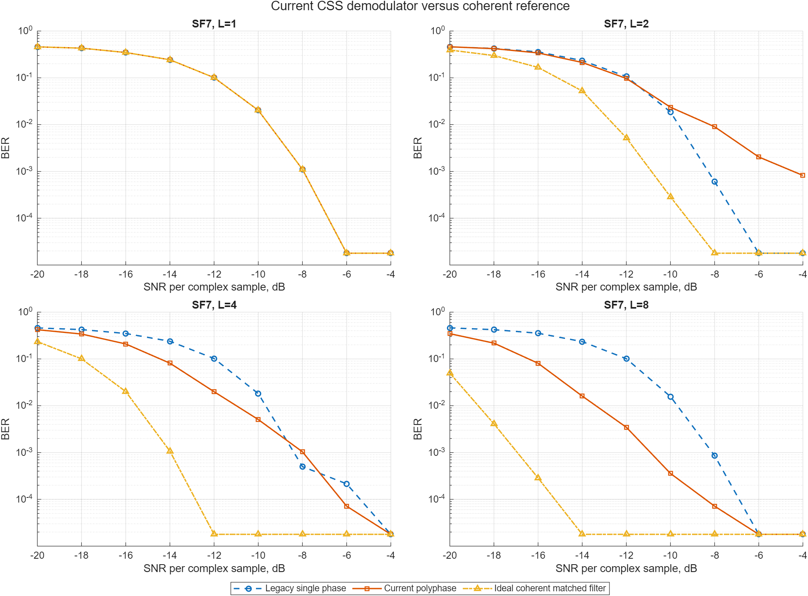
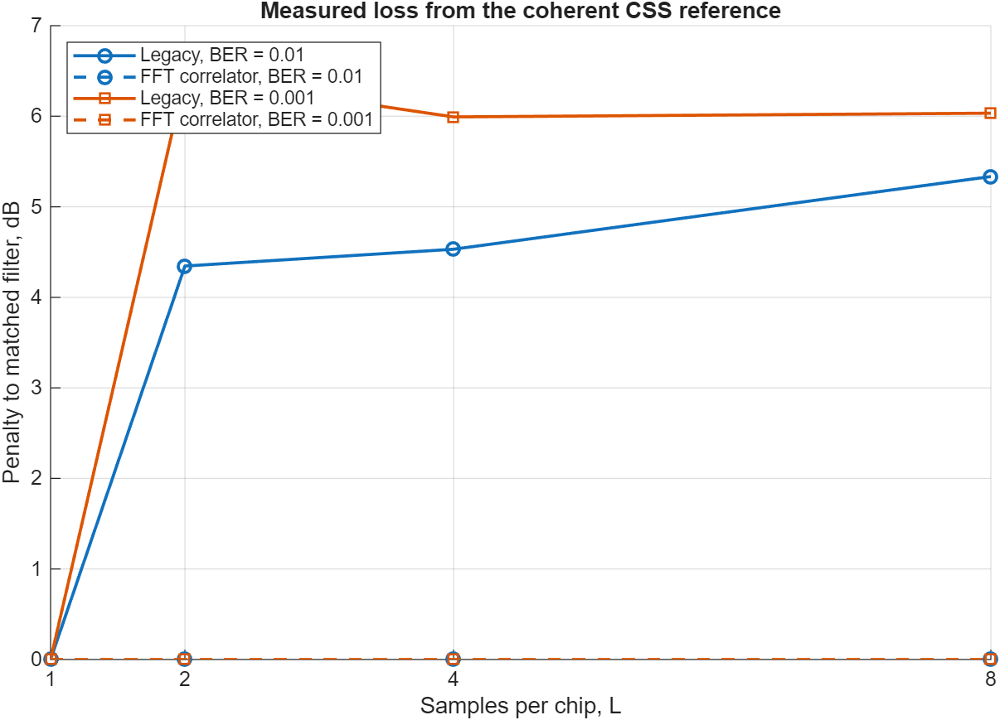
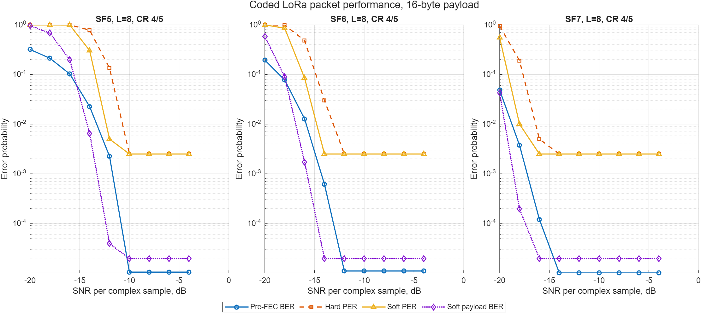

# Методика BER/SER/PER

[English version](../ber-methodology.md)

В репозитории отдельно измеряются ошибки демодулятора и ошибки пакетного
декодера. Оба AWGN-эксперимента используют фиксированные seed, исходные
счётчики ошибок, явные знаменатели и двусторонние 95%-интервалы Wilson.

## Сравнение демодуляторов с когерентным эталоном без FEC

`simulate_uncoded_ber` передаёт независимые равномерные CSS symbol indices при
известном времени символа. После добавления комплексного AWGN принятый индекс
и его естественная двоичная метка сравниваются с переданными значениями.

Четыре приёмника получают одинаковые seeded waveform и noise: legacy FFT по
первой фазе децимации, legacy-некогерентная сумма мощностей polyphase FFT,
новый FFT-correlator и точный matched-filter reference. Последние два выполняют
циклическую корреляцию всех комплексных отсчётов со всеми циклическими сдвигами
CSS chirp и когерентно объединяют `L` отсчётов.

| Параметр | Значение |
|---|---:|
| SF | 7 |
| Samples/chip, `L` | 1, 2, 4, 8 |
| Демодуляторы | single-phase, polyphase, fft-correlator, matched-filter |
| Символов на SNR/mode | 4 000 |
| Label bits на SNR/mode | 28 000 |
| SNR sweep | −20:2:−4 dB |
| Seed | `70 + L` |



Исходные результаты: [`css-ber-demodulator-comparison.csv`](../data/css-ber-demodulator-comparison.csv).
При `L=8` интерполяция в логарифмическом масштабе BER даёт старой polyphase
сумме проигрыш `5,33 dB` при BER `1e−2` и `6,03 dB` при BER `1e−3`.
FFT-correlator алгебраически эквивалентен точному matched filter: измеренный
разрыв равен `0 dB` для всех исследованных `L` и порогов BER:



Пороги и разрывы: [`css-ber-ideal-gap.csv`](../data/css-ber-ideal-gap.csv).
Проигрыш legacy polyphase не обязан точно равняться `10 log10(L)`: мощности фаз
складываются некогерентно, а энергия соседних bins около циклического переноса
chirp меняет waterfall, особенно при `L=2`.

Для `M=N·L` FFT-correlator выполняет `M`-точечный FFT, умножение на комплексно
сопряжённый спектр опорного chirp, суммирование bins `m+rN` и `N`-точечный
прямой FFT. Результат точно совпадает с нужными корреляциями matched filter в
точках `−kL`; полный `M`-точечный IFFT и банк временных шаблонов не нужны. Эта
декомпозиция выбрана кандидатом для Simulink.

Matched filter является идеальным только внутри данного эксперимента: время
символа и форма сигнала известны точно, канал содержит только AWGN, отсутствуют
CFO, SFO, multipath, clipping и quantization. Это не предел Шеннона и не
характеристика обнаружения полного пакета.

В uncoded baseline не входят acquisition, whitening, interleaving, FEC,
header, CRC, packet rejection, CFO/SFO, multipath и clipping. Это характеристика
демодулятора, а не прикладная пакетная надёжность.

## Определение SNR и энергии

`SNR_dB` — отношение средней мощности complex signal sample к средней мощности
complex noise sample до dechirp. Для `L = samplesPerChip`:

```text
Fs = BW × L
Ns = 2^SF × L
Es/N0 [dB] = SNRsample [dB] + 10 log10(Ns)
Eb/N0 [dB] = SNRsample [dB] + 10 log10(Ns / SF)
```

Последняя формула относится к `SF` uncoded label bits. В uncoded CSV сохранены
обе пересчитанные оси. Для coded sweep `EbN0_dB` использует энергию всех
header/payload symbols на число user payload bits; преамбула не учитывается,
поскольку начало пакета известно.

## Coded sweep SF5/SF6/SF7

`simulate_coded_ber` строит explicit header, payload CRC, whitening, Hamming
FEC, diagonal interleaving, Gray mapping и CSS waveform, добавляет AWGN и
выполняет обратную цепочку. Hard и soft decoder получают одни FFT metrics.

| Параметр | Значение |
|---|---:|
| SF | 5, 6, 7 |
| Samples/chip | 8 |
| Coding rate | 4/5 |
| Payload | 16 bytes |
| Header / CRC | explicit / enabled |
| Пакетов на SNR/SF | 200 |
| Payload bits на SNR/SF | 25 600 |
| SNR sweep | −20:2:−4 dB |
| Seeds | 105, 106, 107 |



Исходные результаты: [`lora-coded-ber-sf5-sf7-fft-correlator.csv`](../data/lora-coded-ber-sf5-sf7-fft-correlator.csv).
При −10 dB в 200 пакетах для каждого SF5, SF6 и SF7 не наблюдалось ошибок
символов, payload или пакетов. Конечный Monte Carlo не доказывает нулевую
вероятность ошибки: верхняя граница Wilson сохранена в CSV.

## Устойчивость на реальном сигнале

Ранний nominal-прогон декодировал только 118 из 130 сохранённых передач
SX1262→ZynqSDR, а первый hybrid-прогон выбрал FFT-correlator для 56 пакетов и
polyphase fallback для 74. Основной причиной оказалась неоднозначность
синхронизации: dechirp-bin одного upchirp смешивает целочиповый timing offset и
CFO. Обновлённый приёмник совместно использует знаковые bins upchirp и
downchirp, у которых временные слагаемые имеют противоположные знаки, и
разделяет timing/CFO. Повторная обработка даёт 130/130: все 130 выбрали
FFT-correlator, polyphase не потребовался. Fallback пока остаётся защитной
ветвью до более широких аппаратных sensitivity/interference испытаний; старый
split не доказывает несовпадение формы реального chirp.

## Метрики

| Метрика | Сравнение | Смысл |
|---|---|---|
| SER | TX/RX CSS indices | ошибки символов демодулятора |
| Pre-FEC BER | TX/RX interleaver codeword bits | канал и hard CSS decisions |
| Hard/soft payload BER | исходный/dewhitened payload | остаточные ошибки декодера |
| Hard/soft PER | payload вместе с header/CRC | пакетная ошибка декодера |
| Soft recovered | hard packet failed, soft packet exact | выигрыш soft decoder |
| Undetected errors | CRC pass при неверном payload | наблюдение безопасности CRC |

Если декодер вернул неправильную длину, ошибочными считаются все user payload
bits. Packet error включает failed header, failed CRC, неверную длину или любое
расхождение payload. Ошибочные пакеты не исчезают из denominator.

## Доверительные интервалы и нулевые ошибки

В CSV остаются точные наблюдаемые отношения. Для uncoded BER/SER и основных
coded BER/PER сохранены двусторонние 95%-интервалы Wilson. Ноль ошибок не
доказывает нулевую вероятность: на logarithmic plot такая точка показана на
уровне `0.5/N`. Например, для 0 ошибок из 200 верхняя граница Wilson всё ещё
равна примерно 1,88%.

## Воспроизведение

```matlab
cd model/matlab
addpath examples
campaign = plot_ber_campaign;
```

Команда заново создаёт три PNG, три CSV и
[`ber-demodulator-campaign.mat`](../data/ber-demodulator-campaign.mat).
Исторические результаты доступны через Git history. Текущая схема MAT —
`zynq-lora-ber-campaign-v3`; таблица `idealGap` содержит старый и текущий
проигрыш.

Coded sweep по-прежнему предполагает известное время и не передаёт преамбулу.
Будущий acquisition-inclusive hardware sweep должен отдельно считать attempts,
detected preambles, synchronized frames, decoded headers, CRC-pass packets и
bit-correct payloads.
