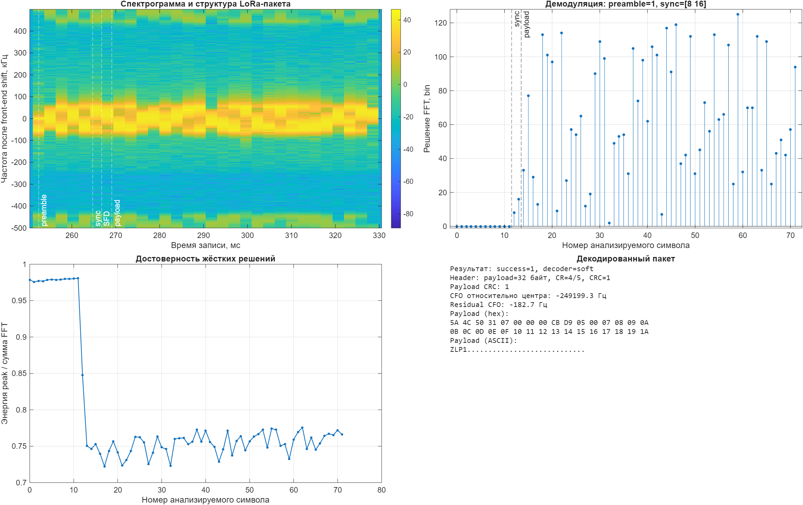

# MATLAB floating-point модель

[English version](../../model/matlab/README.md)

Это авторитетный алгоритмический уровень проекта. Он содержит CSS waveform и
пакетную LoRa-цепочку с жёсткими решениями: explicit header, payload CRC,
whitening, Hamming, diagonal interleaving, Gray mapping и обратный RX-тракт.

## Запуск тестов

```matlab
cd model/matlab
results = run_tests;
assertSuccess(results);
```

## Построение всех графиков

```matlab
outputs = run_visualizations;
```

Только визуализация демодуляции символов:

```matlab
addpath examples
[result, figureHandle] = plot_symbol_demodulation;
```

Экспорт детерминированного packet golden-вектора:

```matlab
vector = export_golden_vectors;
```

Функции пакета используют столбцы. CFO задаётся в циклах на отсчёт. Для
физической частоты дискретизации `Fs`:

```text
cfoNormalized = cfoHz / Fs
```

## Воспроизводимая модель канала и аналогового тракта

`lora_phy.apply_channel_impairments` позволяет проверять приёмник без стенда и
без дополнительных MATLAB toolbox. За один вызов она моделирует:

- дробную задержку и многолучёвость;
- рассогласование частот дискретизации SFO в ppm;
- частотную отстройку CFO в герцах;
- дисбаланс усиления и фазы I/Q, а также DC offset;
- комплексный AWGN с фиксированным seed.

```matlab
rx = lora_phy.apply_channel_impairments(tx, Fs, ...
    FractionalDelaySamples=2.25, SampleRateOffsetPpm=20, ...
    MultipathDelaysSamples=[0; 3.5], MultipathGains=[1; 0.3j], ...
    FrequencyOffsetHz=1800, IqGainImbalanceDb=0.5, ...
    IqPhaseImbalanceDegrees=2, SnrDb=-8, RandomSeed=42);
```

Положительный SFO означает более быстрое продвижение по отсчётам переданного
сигнала, а положительная дробная задержка сдвигает принятый сигнал вправо.
Длина результата совпадает с длиной входа; за его границами подставляются нули.

## Декодирование реальной LoRa-посылки

`encode_packet` формирует индексы CSS-символов и сохраняет промежуточные
векторы. `decode_packet` принимает жёсткие решения по символам.
`receive_lora_packet` выполняет сквозной приём стандартной эфирной посылки:
находит преамбулу, проверяет sync word, учитывает SFD из 2,25 downchirp,
компенсирует CFO, выбирает границу символа и декодирует header/FEC/whitening/CRC.
Поддержаны особенности SX126x для SF5/SF6 и inverted IQ.

```matlab
addpath examples
d = "../../captures/reference/2026-08-03-heltec-v43-zynqsdr-mode-sweep";
[iq, ~] = lora_phy.load_iq_capture(fullfile(d, "sf7-bw125.cf32"), "cf32");
rx = lora_phy.receive_lora_packet(iq, 1e6, 125e3, 7, ...
    PreambleSymbols=12, SyncWord=hex2dec("12"), ...
    ExpectedCarrierOffsetHz=-250e3);
lora_phy.visualize_lora_packet(iq, 1e6, rx);
```



`receive_lora_packets` находит все разделённые паузами передачи. Для каждого
символа сохраняются FFT metrics, из которых soft decoder получает max-log LLR.
Полный прогон с сопоставлением TX-журналу и BER/PER выполняет
`evaluate_reference_sweep`; `decode_reference_sweep` остаётся кратким
single-packet отчётом. Подробнее:
[методика и результаты декодирования](lora-packet-decoder.md).

При `samplesPerChip > 1` после dechirp вычисляется отдельный chip-rate FFT для
каждой фазы передискретизации. `polyphase_spectrum` складывает мощности
одноимённых bins вместо выбора только первой фазы. Отображение LoRa-символов не
меняется, а зависимость от фазы timing и разброс метрик уменьшаются. Этот блок
нужно сохранить при переносе модели в Simulink и RTL.

## Определения BER

`simulate_uncoded_ber` сравнивает двоичные метки переданных и обнаруженных CSS
символов в AWGN. Пятый аргумент переключает рабочее polyphase-объединение и
legacy single-phase baseline. В результат входят raw counts, denominators,
оси энергии и 95%-интервалы Wilson; преамбула, FEC и CRC не моделируются.

`simulate_coded_ber` сообщает pre-FEC BER, hard/soft payload BER и PER,
soft-recovered packets, ошибки header/CRC и undetected errors. Если заголовок
не декодирован или длина неверна, все payload bits считаются ошибочными.

Текущая кампания воспроизводится командой:

```matlab
addpath examples
campaign = plot_ber_campaign;
```
