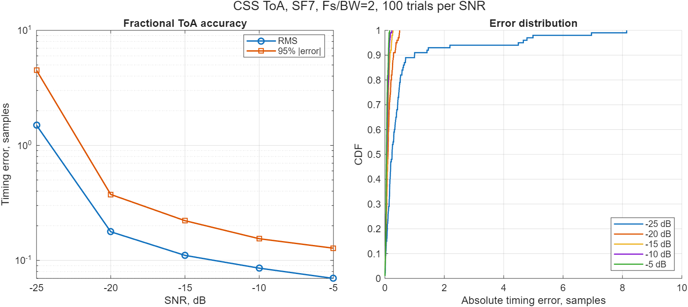

# Методика оценки дробного времени прихода

[English version](../toa-methodology.md)

В floating-point модели разделены три временные величины:

1. `startIndex` — целочисленный максимум согласованного фильтра в однобазовой
   индексации MATLAB.
2. `fractionalOffsetSamples` — локальная поправка в диапазоне `[-0.5, 0.5]`.
3. `toaSamples = startIndex - 1 + fractionalOffsetSamples` — нулевой timestamp,
   который используется в измерениях и дальнейшем вычислении TDoA.

`lora_phy.estimate_fractional_toa` выполняет нормированную корреляцию известной
комплексной преамбулы с записью и аппроксимирует мощность корреляции тремя
точками параболы около целого максимума. Дополнительно возвращаются
нормированный peak score и отношение максимума к боковому лепестку. Известный
грубый старт и радиус поиска ограничивают оценку нужным пакетом.

```matlab
toa = lora_phy.estimate_fractional_toa(iq, knownPreamble, Fs, ...
    CoarseStartIndex=coarseIndex, SearchRadiusSamples=8);
```

## Воспроизводимый тест в AWGN

`lora_phy.simulate_toa_accuracy` для каждого испытания генерирует равномерную
дробную задержку, добавляет комплексный AWGN и сохраняет исходную ошибку,
смещение, стандартное отклонение, RMS и 95-й процентиль абсолютной ошибки.

```matlab
result = lora_phy.simulate_toa_accuracy([-25; -20; -15; -10; -5], ...
    TrialsPerPoint=100, SpreadingFactor=7, SamplesPerChip=2, ...
    RandomSeed=31415);
```

Зафиксированный детерминированный прогон даёт RMS-ошибку `0,177` отсчёта при
−20 dB и `0,070` отсчёта при −5 dB. При −25 dB начинается пороговая область:
RMS возрастает до `1,50` отсчёта. Это характеристика алгоритма в AWGN, а не
утверждение об абсолютной точности аппаратного времени распространения.



## Калиброванный TDoA и решение 2D-задачи

`tdoa_from_toas` вычитает постоянную задержку каждого приёмного канала до
формирования разностей относительно приёмника 1. `predict_tdoa` реализует
геометрическую прямую модель. `solve_tdoa` использует взвешенный метод
Гаусса—Ньютона и возвращает позицию, временные residuals, convergence,
приближение covariance и condition number геометрии. Solver принимает полную
covariance наблюдений: ошибки TDoA коррелированы, потому что timestamp опорного
приёмника входит во все разности.

```matlab
tdoa = lora_phy.tdoa_from_toas(measuredToaSeconds, ...
    ReceiverDelaySeconds=calibratedChannelDelays);
position = lora_phy.solve_tdoa(receiverPositionsMeters, tdoa, ...
    MeasurementStdSeconds=timestampUncertaintySeconds);
```

Воспроизводимый Monte Carlo для четырёх приёмников и его ограничения приведены
в [приёмке floating-point MATLAB M1](matlab-m1-acceptance.md).


## Последовательность аппаратной проверки

После возвращения стенда алгоритм остаётся тем же, а источник данных меняется
в следующем порядке:

1. кабельная петля с фиксированным аттенюатором для каждого SF/BW и усиления;
2. оценка постоянной задержки RF/baseband и температурного дрейфа;
3. публикация bias, стандартного отклонения, 95-го процентиля, доли выбросов и
   контрольной суммы исходной IQ-записи;
4. только после калибровки — вычитание timestamps, расчёт TDoA и перенос их
   неопределённости во взвешенное позиционное решение.

Текущая AWGN-кривая не учитывает bias многолучёвости, групповую задержку
AD936x, неопределённость timestamp буфера и рассогласование опорных генераторов.
Эти величины должны входить в калибровку и бюджет неопределённости.

Для curated reference sweep с payload-счётчиками отчёт повторяемости OTA
пересчитывается командой:

```matlab
addpath examples
result = evaluate_reference_toa(datasetDirectory, "toa-sf7-bw125", ...
    OutputDirectory=datasetDirectory);
```

Аффинная аппроксимация удаляет разные эпохи TX/RX и линейное рассогласование
частот их часов. В остаток всё ещё входят квантование timestamp передатчика,
планирование, вариации RF/baseband latency, многолучёвость и ошибка RX-оценки.
